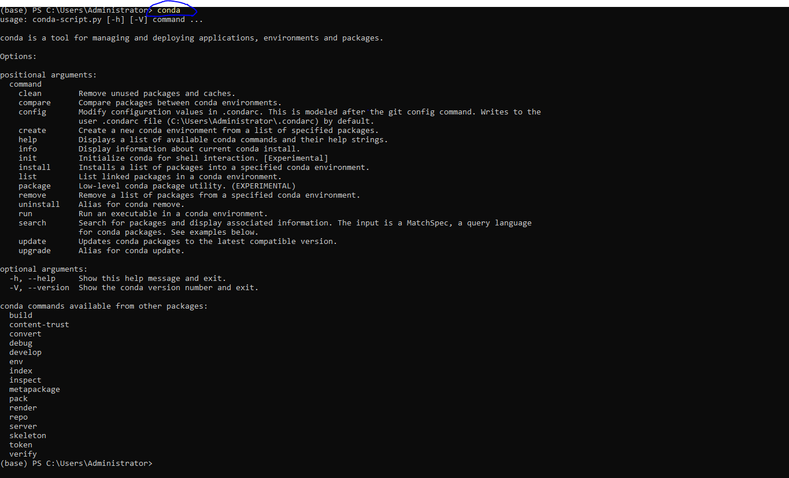
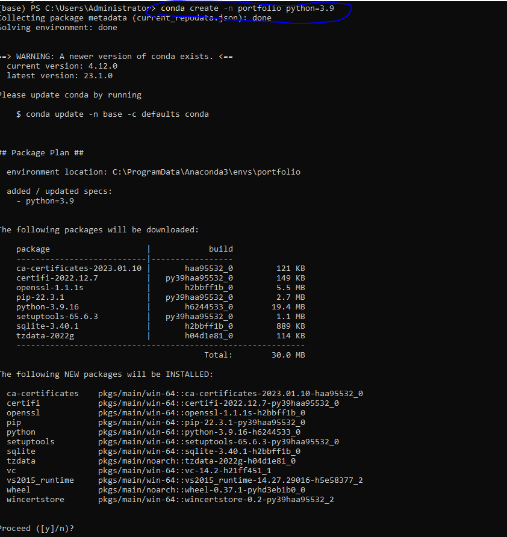
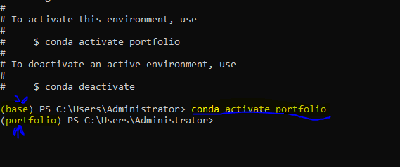
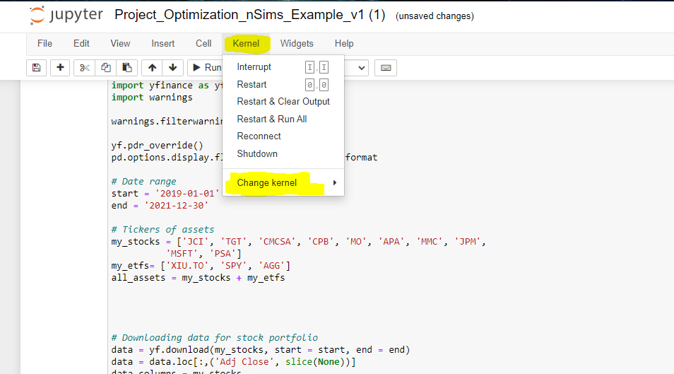
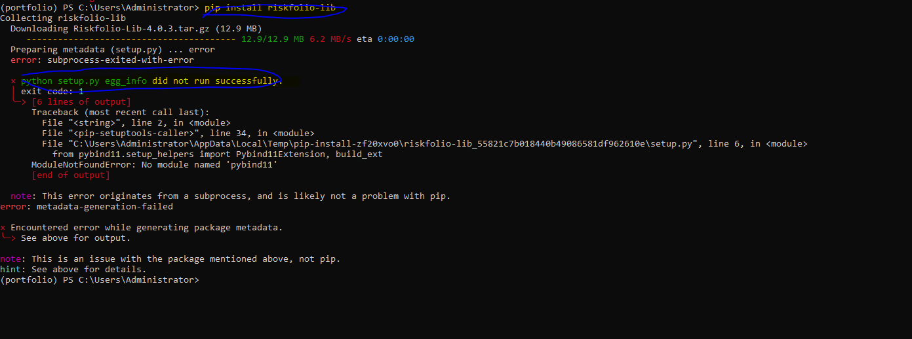

# Installation Process

## Conda Installation
1. Install conda from [here](https://docs.conda.io/en/latest/miniconda.html)
2. Run `conda` on your terminal/CMD
Output should be something like this:

3. Create a new environment using `conda create -n portfolio python=3.7`
Output should be something like this:

4. Activate the environment using `conda activate portfolio`
Output should be something like this:

6. Install ipykernel using `conda install ipykernel`
7. Add the environment to jupyter notebook using `python -m ipykernel install --user --name portfolio`
8. Run `jupyter notebook` on your terminal/CMD
9. Open the notebook `portfolio.ipynb`
10. Change the kernel to `portfolio` using `Kernel > Change Kernel > portfolio`
Output should be something like this:

10. Install the required packages using `pip install -r requirements.txt` OR `pip install pandas numpy yfinance`
11. Install riskfolio-lib using `pip install riskfolio-lib`
12.  First Error `setup.py` not found
output should be something like this:

13. Install setuptools using `pip install setuptools`
14.  Second Error `Microsoft Visual C++ 14.0 is required` 
15. Install Miscrosoft Visual C++ Build Tools using `https://visualstudio.microsoft.com/visual-cpp-build-tools/`
16. Select all of the above 4 options
17. Install riskfolio-lib using `pip install riskfolio-lib`
18. Run the notebook
19. Enjoy!